---
title: "Reducing Wastage in a bakery" 
subtitle: "MTH6139 Time Series Coursework 1 -- Template" 
author: "Ysabela Leite" 
date: "Spring term 2025" 
output: 
  html_document:
    toc: true
    toc_float: true
    theme: spacelab 
    highlight: tango
---
 
```{r, echo=FALSE}
# This code will display the QMUL logo at the top right of the page
# Do not change this code
htmltools::img(src = knitr::image_uri("images/QMlogo.png"),
               alt = 'logo',
               style = 'position:absolute; top:0; right:0; padding:10px; width:20%;')
```

# Section 1: Introduction and Aims
For my coursework project, I wanted to look at some time series relevant to my current work. Outside of being a student, I am a barista for a newly opened cafe. The cafe is in Soho for a flagship store of a fashion brand. Since we are still new, with less than 1 year of being open, we have a lot of learning, experimenting and trial and error to do in order to acheive the level of sucess and business we aim for. We are the first coffee shop associated with the brand and completely independent, so even the part time baristas like myself contribute greatly to the growth of the business.

We sell a small selection of bakery treats, with only 5 different items available daily, and yet we still finish the day with a lot of wastage. Some days we are forced to discard the treats in their entirety as they do not sell! To make the most of this project, I wanted to use this as an opportunity to analyse trends and interests in different bakery items to minimise wastage and to see if we can adjust the items available by the time of the year. I also want to analyse new trending buzzwords to see if certain items are worth investing in and if so what time of the year they are most popular.


## 1.1 The data


I decided to get datasets from Google trends, to look up interest in some different bakery items by search frequency. Using Prophet, I can forecast the interest in certain items or categories to better plan our bakery selection for the rest of the year.

it is important to understand the way the dataset is set up to fully analyse correctly.

I have got six csv files, each falling under one of two categories: One is with some different bakery items, and one with some different food descriptors which have been trending recently. All data sets are time series from January 1st 2023 to January 1st 2026, to look at the past 3 years. The entries are timed by month, with the y value being interest level from 0-100.

from using Google trends there are certain limitations as it only shows monthly data when looking across multiple years. As well as this the data is scaled into relative search interest rather than absolute demand, which may not directly correspond to actual consumer purchasing behaviour. Despite this, it should still give us a better understanding of how to plan our bakery items 

## 1.2 Data preparation AND SET UP

to be able to use prophet, I have to slightly alter my data by cleaning it and reajusting the column names, converting the time column into dates, and ensuring that the interest values are read as numerical data. To make sure everything is working, i plotted them as a final step.

dfbanana <- read.csv("data/3ybananabread.csv" , header = TRUE, sep=",")
dflemon <- read.csv("data/3ylemondrizzle.csv" , header = TRUE, sep=",")
dfginger <- read.csv("data/3ygingerbread.csv" , header = TRUE, sep=",")
dftiramisu <- read.csv("data/3ytiramisu.csv" ,  header = TRUE, sep=",")

dfprotein <- read.csv("data/3yprotein.csv" , header = TRUE, sep=",")
dfvegan <- read.csv("data/3yvegan.csv" , header = TRUE, sep=",")

summary(dfbanana)
head(dfbanana)

colnames(dfbanana) <- c("ds" , "y")
dfbanana$ds <- as.Date(dfbanana$ds)
dfbanana$y <- as.numeric(dfbanana$y)
plot(dfbanana$ds, dfbanana$y, type = "l",
     main = "Banana Bread Search Interest",
     xlab = "Date", ylab = "Search Interest")

colnames(dflemon) <- c("ds", "y")
dflemon$ds <- as.Date(dflemon$ds)
dflemon$y <- as.numeric(dflemon$y)

plot(dflemon$ds, dflemon$y, type = "l",
     main = "Lemon Drizzle Search Interest",
     xlab = "Date", ylab = "Search Interest")

colnames(dfginger) <- c("ds", "y")
dfginger$ds <- as.Date(dfginger$ds)
dfginger$y <- as.numeric(dfginger$y)

plot(dfginger$ds, dfginger$y, type = "l",
     main = "Gingerbread Search Interest",
     xlab = "Date", ylab = "Search Interest")

colnames(dftiramisu) <- c("ds", "y")
dftiramisu$ds <- as.Date(dftiramisu$ds)
dftiramisu$y <- as.numeric(dftiramisu$y)

plot(dftiramisu$ds, dftiramisu$y, type = "l",
     main = "Tiramisu Search Interest",
     xlab = "Date", ylab = "Search Interest")

colnames(dfprotein) <- c("ds", "y")
dfprotein$ds <- as.Date(dfprotein$ds)
dfprotein$y <- as.numeric(dfprotein$y)

plot(dfprotein$ds, dfprotein$y, type = "l",
     main = "Protein Search Interest",
     xlab = "Date", ylab = "Search Interest")

colnames(dfvegan) <- c("ds", "y")
dfvegan$ds <- as.Date(dfvegan$ds)
dfvegan$y <- as.numeric(dfvegan$y)

plot(dfvegan$ds, dfvegan$y, type = "l",
     main = "Vegan Search Interest",
     
     


# Section 2: Prophet
Now that my data is in the correct format to use prophet with we can use it to make forecasts based on the data from google trends

library(prophet)

## 2.1 Banana bread
here we add the code which uses prophet to predict the future interest in banana bread. I set the period to 365 to get a full years prediction. 


banana_model <- prophet(dfbanana)

banana_future <- make_future_dataframe(banana_model, periods = 12 , freq = "month")

banana_forecast <- predict(banana_model, banana_future)

plot(banana_model, banana_forecast)
plot(banana_model, banana_forecast)
prophet::prophet_plot_components(banana_model, banana_forecast)


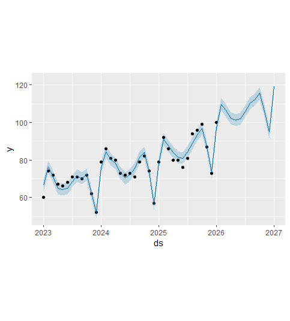
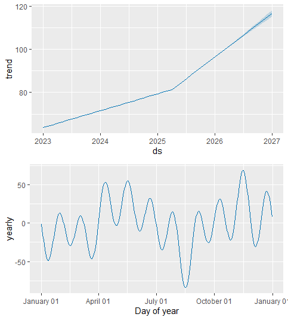

The model has shown us that interest in banana bread will slowly increase. In the original plot, i could see that each winter there was a decline in interest of banana bread and the forecast shows this also. From this data though i can conclude that this item is a bakery item that i can keep in the selection for most of the year, with interest slowly increasing. This makes sense as currently it is our best selling bakery item. Intuitively, however, i can interpret this as a sign to look for other products in the winter.


## 2.2 lemon drizzle

lemon_model <- prophet(dflemon)

lemon_future <- make_future_dataframe(lemon_model, periods = 12 , freq = "month")

lemon_forecast <- predict(lemon_model, lemon_future)

plot(lemon_model, lemon_forecast)
prophet::prophet_plot_components(lemon_model, lemon_forecast)

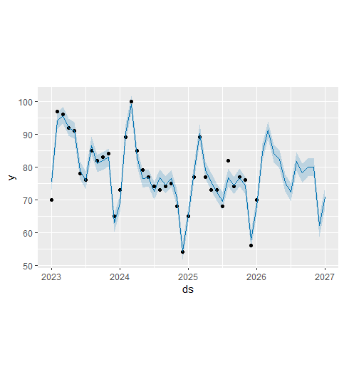
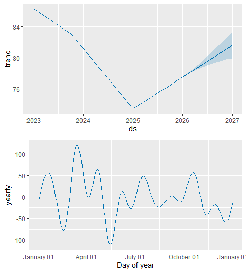
Here prophet shows us that the interest in lemon drizzle is increasing after some indifference to it in 2025. It suggests that lemon drizzle will be most popular in the beginning of spring but decline in the early summer months, and stabilise throughout autumn and winter. This means i should suggest looking into different items in the summer, as people are looking for more lighter treats.


## 2.3 gingerbread

ginger_model <- prophet(dfginger)

ginger_future <- make_future_dataframe(ginger_model, periods = 12 , freq = "month")

ginger_forecast <- predict(ginger_model, ginger_future)

plot(ginger_model, ginger_forecast)
prophet::prophet_plot_components(ginger_model, ginger_forecast)

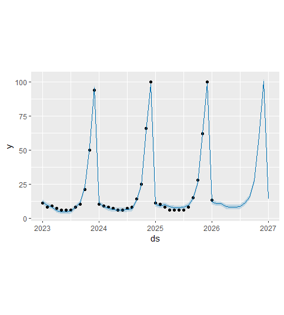
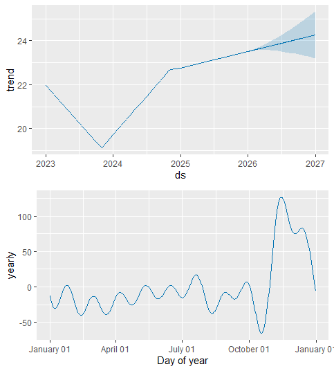

I found these plots very interesting as they show clear seasonality, which  aligns with what we know, that gingerbread is more popular around Christmas time and sharply declines after that. The interest in gingerbread through most the year is stable at a low rate throughout most the year, so we should aim to only bring in gingerbread items at wintertime.  


## 2.4 tiramisu

tiramisu_model <- prophet(dftiramisu)

tiramisu_future <- make_future_dataframe(tiramisu_model, periods = 12 , freq = "month")

tiramisu_forecast <- predict(tiramisu_model, tiramisu_future)

plot(tiramisu_model, tiramisu_forecast)
prophet::prophet_plot_components(tiramisu_model, tiramisu_forecast)

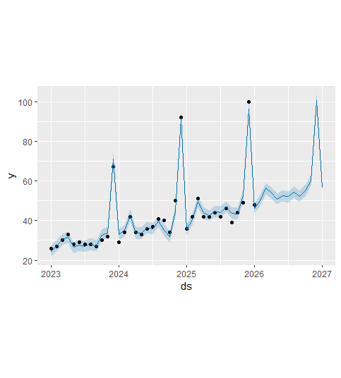
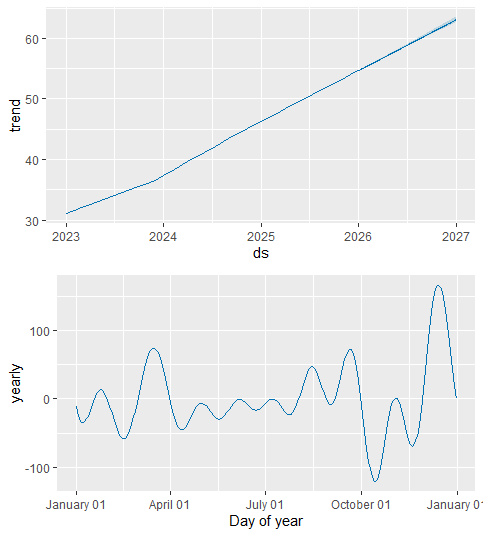
This one surprised me- as I didnt expect tiramisu to be so popular during winter as it is a cold dessert. Despite this the data  again shows clear seasonality, around holiday periods of winter and mid spring, which i can assume is because of Christmas, Eid and Easter. During other periods the interest is minimal, which tells me that it should not be a permanent bakery item. Another thing i can see is that it is showing a clear increase in the trend, suggesting it is gaining a lot of popularity.   


## 2.5 protein 

protein_model <- prophet(dfprotein)

protein_future <- make_future_dataframe(protein_model, periods = 12 , freq = "month")

protein_forecast <- predict(protein_model, protein_future)

plot(protein_model, protein_forecast)
prophet::prophet_plot_components(protein_model, protein_forecast)

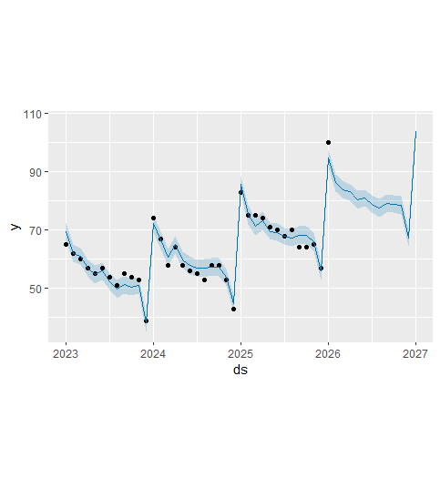
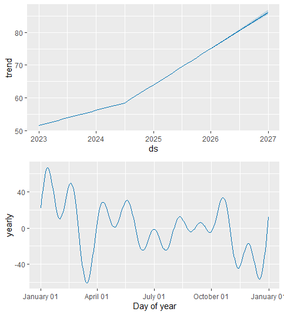

I wanted to explore some different types of items to see if they are worth investing in and what times of the year to bring them in. The trend graph shows clearly that protein is gaining popularity, as society shifts to being more health conscious. interestingly though, it shows that the interest peaks in early year months like january and february as people choose to attempt a better lifestyle in the new year. it slowly decreases in winter, where people are more focused on the holidays and think less about health  choices. This inspires me to bring in high protein treats in the new year to attract people to the cafe. 


## 2.6 vegan 

vegan_model <- prophet(dfvegan)

vegan_future <- make_future_dataframe(vegan_model, periods = 12 , freq = "month")

vegan_forecast <- predict(vegan_model, vegan_future)

plot(vegan_model, vegan_forecast)
prophet::prophet_plot_components(vegan_model, vegan_forecast)

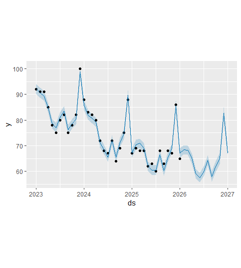
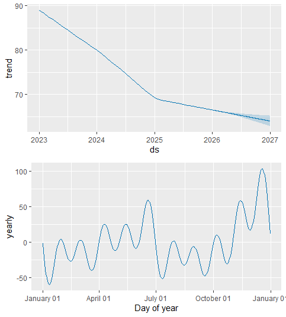
Similarly to protein, i wanted to look at the seasonality of veganism. I expected similar results, however I was surprised to see that veganism is showing a decline in interest by trends. This suggests to me that it is not a type of product worth investing in, but if i still chose to, the best time to introduce it to our selection is during summer months. I speculate that this is because we have fresh vegetation and people want lighter food. Another thing that surprised me was seeing that the interest peaks during the winter time.

# Section 3: conclusion

## 3.1 conclusion

Using Meta's Prophet model has definitely given me a clear insight on what sort of products to introduce/keep in the cafe and how to plan our selection, with clear seasonal behaviour given for the different food related search terms. We can see this in the patterns of popularity and long term trends. 

Bakery items such as banana bread and lemon drizzle show relatively consistent interest over time, with noticeable seasonal fluctuations. Banana bread demonstrates a gradual upward trend with recurring dips during winter periods, suggesting it remains a reliable year-round product but can be replaced by winter seasonal items. In contrast, lemon drizzle shows clearer seasonal variation, with peaks occurring in spring and early summer, indicating stronger short-term demand cycles, so we can have it as a spring seasonal item.

More seasonal products such as gingerbread and tiramisu display pronounced fluctuations linked to specific times of the year. Gingerbread shows strong peaks around winter months, particularly consistent with holiday periods, followed by a sharp decline throughout the rest of the year. Tiramisu, while less intuitively seasonal, also exhibits increased interest during holiday periods, alongside a long-term upward trend, suggesting growing popularity but not consistent year-round demand. 

Health-related and lifestyle-oriented terms such as protein and vegan show different behaviour compared to traditional bakery items. Protein-related searches demonstrate a strong upward trend, with peaks at the beginning of the year, likely reflecting New Year’s resolutions and increased health consciousness. This tells me high protein bakery treats are well worth the investment and could bring in customers. Vegan interest shows an overall declining trend but periodic increases, particularly around summer and winter. However due to the declining trend i will not be in a rush to get in vegan items for our cafe, as the goal is to reduce wastage not increase it.

Finally, i can conclude that bakery items are indeed seasonal, and understanding the seasonality can help reduce wastage in the cafe. Going forwward i can see that it is important to look at this when deciding menu items as some products can surprise you in the times they trend. 

## 3.2 limitations
While Prophet captures trend and seasonality effectively, it may not fully account for sudden external factors such as market changes or promotional events.
- Datacamp course: <https://www.datacamp.com/courses/reporting-with-rmarkdown>
- RStudio reference: <https://rmarkdown.rstudio.com/lesson-1.html>
- More sophisticated reference: <https://bookdown.org/yihui/rmarkdown/>
